# 1.Introduction of Kingsense KSECG-DK

&nbsp;&nbsp;&nbsp;&nbsp;&nbsp;&nbsp;&nbsp;&nbsp;KSECG-DK Evaluation and Development Board is based on the high-precision ECG sensing chip KS1081 fingertip bluetooth ECG signal acquisition evaluation board launched by the Shenzhen Kingsense Electronics Co., Ltd. KSECG-DK board integrates KS1081 single-channel ECG chip and Bluetooth 5.0 processor (Nordic nRF528XX) and power management system. The KSECG-DK board integrates the KS1081 single-channel ECG chip with a Bluetooth 5.0 processor (Nordic nRF528XX) and a power management system. Users touch the printed metal electrodes on the board or connect the lead wires to the electrodes to realize high-precision ECG signal (R-Q-R-S-T wave) acquisition and real-time human fingertip high-fidelity ECG waveform display and signal analysis through Bluetooth data transmission and cell phone APP software.

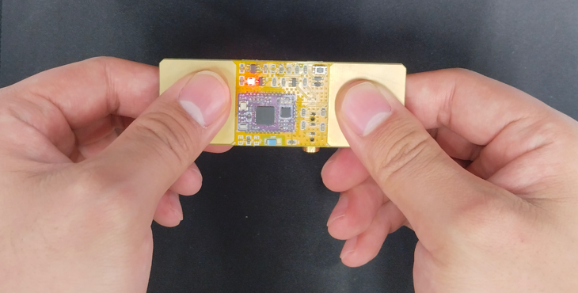

&nbsp;&nbsp;&nbsp;&nbsp;&nbsp;&nbsp;&nbsp;KSECG-DK is a 2-in-1 Bluetooth ECG evaluation development board. It supports fingertip contact with metal electrodes to obtain signals, as well as supporting the use of traditional AgCI electrodes or other fabric, metal, conductive cloth electrodes from the human body to obtain high-precision ECG signals for evaluation through a dedicated ECG leadwire. Users can buy this product in Taobao store, product link: [KS1081 Finger ECG fingertip Bluetooth wireless ECG development heart rate data acquisition SDK algorithm cell phone app](https://item.taobao.com/item.htm?id=621624018377&spm=a1z10.1-c.w4004-22915527887.4.23164e45hSs0N4)

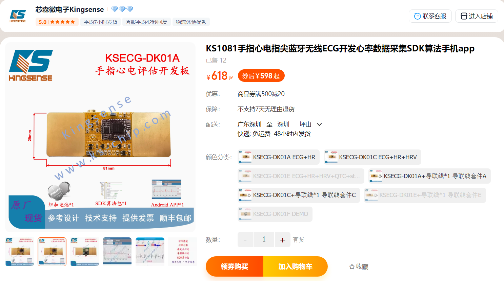

# 2. Monitoring Indicators

&nbsp;&nbsp;&nbsp;&nbsp;&nbsp;&nbsp;&nbsp;&nbsp;&nbsp;Heart rate (HR) and its derivatives play a key role in assessing cardiac health and physiologic status. Heart rate, or the number of heartbeats per minute, is a direct reflection of the intensity of cardiac activity. Heart rate variability (HRV) shows the heart's adaptability to physiologic and environmental changes and is measured by detecting fluctuations in heartbeat intervals. The QTc interval on the electrocardiogram, corrected for ventricular depolarization and repolarization times, is an important indicator of comparative cardiac function at different heart rates. Stress indices, based on HRV parameters such as the LF/HF ratio, assess autonomic nervous system activity and reflect an individual's stress level. Together, these metrics provide a comprehensive monitoring of cardiac health and stress status.

(1) [Heart rate](https://baike.baidu.com/item/%E5%BF%83%E7%8E%87/9517637) (HR, Heart rate)

&nbsp;&nbsp;&nbsp;&nbsp;&nbsp;&nbsp;&nbsp;&nbsp;Heart rate refers to the frequency of the heart's contraction beats and the number of beats per minute, the normal person is calm (resting heart rate) of 60 to 100 beats per minute (60~100 bpm (beats per minute)), the heartbeat will be accelerated when exercising, and the athlete with a better cardiorespiratory function will have a slower heart rate than normal.

(2) [Heart Rate Variability](https://baike.baidu.com/item/%E5%BF%83%E7%8E%87%E5%8F%98%E5%BC%82%E6%80%A7/4437748) (HRV, Heart Rate Variability)

&nbsp;&nbsp;&nbsp;&nbsp;&nbsp;&nbsp;&nbsp;&nbsp;Heart Rate Variability refers to the change in heartbeat cycle-by-cycle difference, which contains information on the regulation of the cardiovascular system by neurohumoral factors, thus determining its condition and prevention of cardiovascular and other diseases, and may be a predictor of sudden cardiac death and arrhythmic events as a valuable indicator for predicting sudden cardiac death and arrhythmic events.

(3) [QTc interval](https://baike.baidu.com/item/QTc%E9%97%B4%E6%9C%9F/5874856) (QTc, QTc interval)

&nbsp;&nbsp;&nbsp;&nbsp;&nbsp;&nbsp;&nbsp;&nbsp;QT interval is the time from the beginning of the QT band to the end of the T band on the electrocardiogram, which represents the total time for the heart's ventricles to depolarize and repolarize. QT intervals vary with heart rate, and therefore the QTc value is often used to represent the corrected QT interval for comparison at different heart rates. Abnormal prolongation or shortening of the QTc may be a risk factor for heart disease.

(4) [Stress Index] () (Stress)

&nbsp;&nbsp;&nbsp;&nbsp;&nbsp;&nbsp;&nbsp;&nbsp;&nbsp;The Stress Index assesses an individual's stress level by analyzing heart rate variability. It is based on heart rate variability parameters such as the low frequency/high frequency ratio (LF/HF ratio), which reflect the state of activity of the autonomic nervous system. The autonomic nervous system controls unconscious activities of the body, such as heartbeat and breathing. A higher stress index usually means a higher level of psychological or physical stress.

# 3. APP page display

&nbsp;&nbsp;&nbsp;&nbsp;&nbsp;&nbsp;&nbsp;&nbsp;APP page design directly affects user experience and functional cognition. The main pages of this application include welcome, registration and login, monitoring, reporting and personal homepage, aiming to provide an intuitive and convenient user experience.

## 3.1 Welcome, Registration and Login Pages

    

    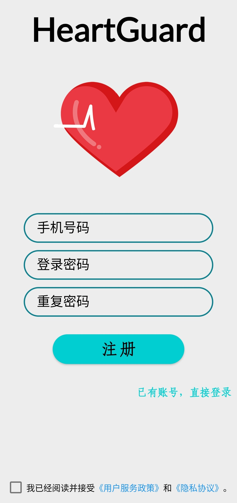
    

    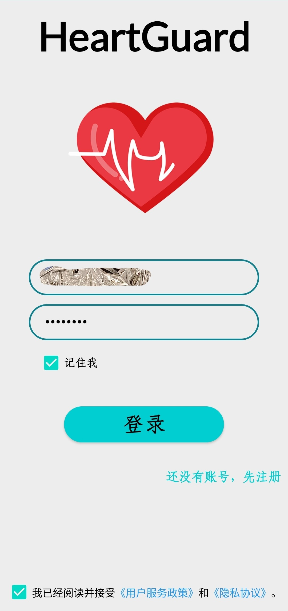

 

&nbsp;&nbsp;&nbsp;&nbsp;&nbsp;&nbsp;&nbsp;&nbsp;When you first start the app, you will see the welcome page for 3 seconds or click the "Skip" button in the upper right corner to quickly enter the "Monitoring" homepage. Please use your mobile phone number to register and log in, and check to agree to the relevant policies and privacy agreements.

## 3.2 Monitoring Home Page

    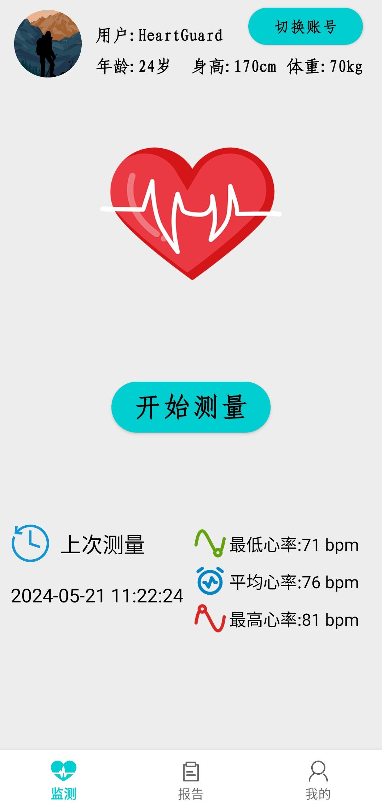
    

    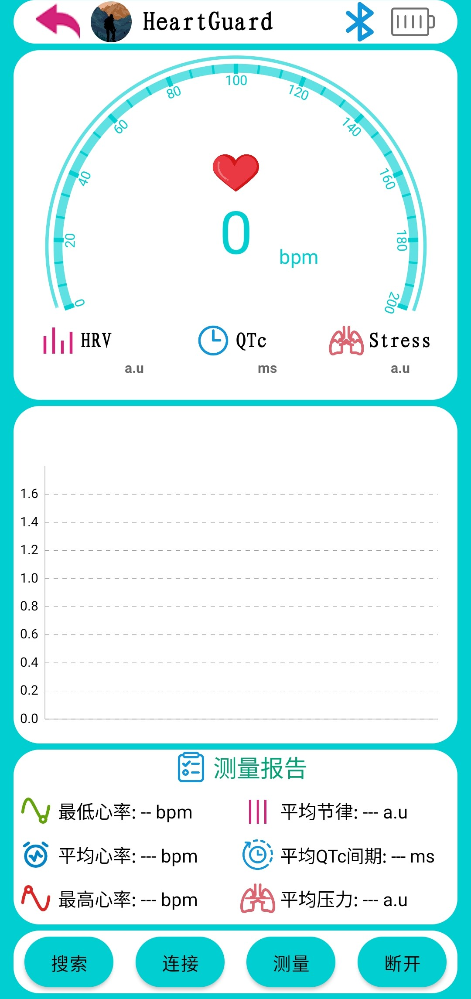

 

&nbsp;&nbsp;&nbsp;&nbsp;&nbsp;&nbsp;&nbsp;&nbsp;The "Monitoring" home page intuitively displays the user's basic information and the last measurement results. Click "Start Measurement" to jump to the heart rate measurement page.

    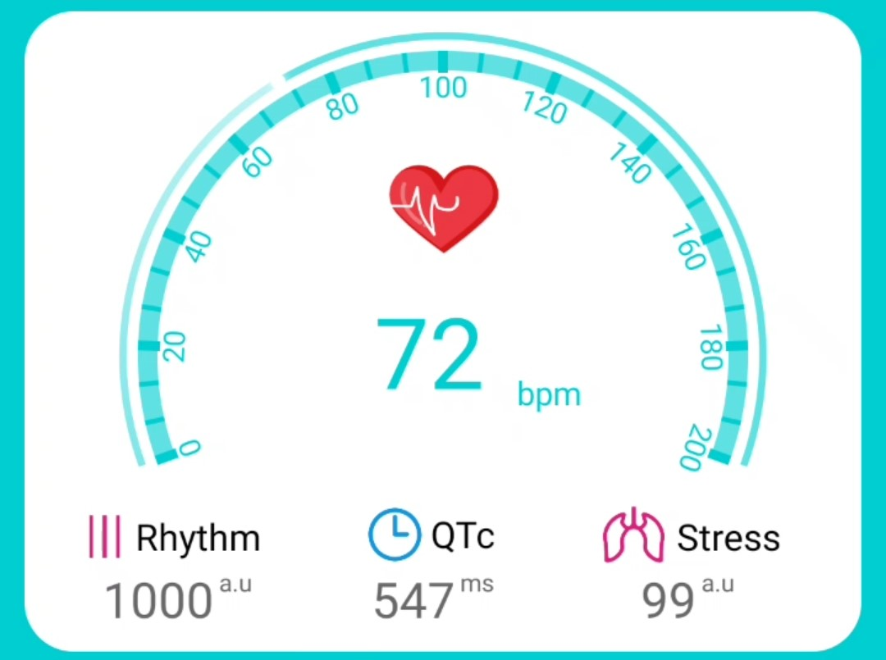
    

    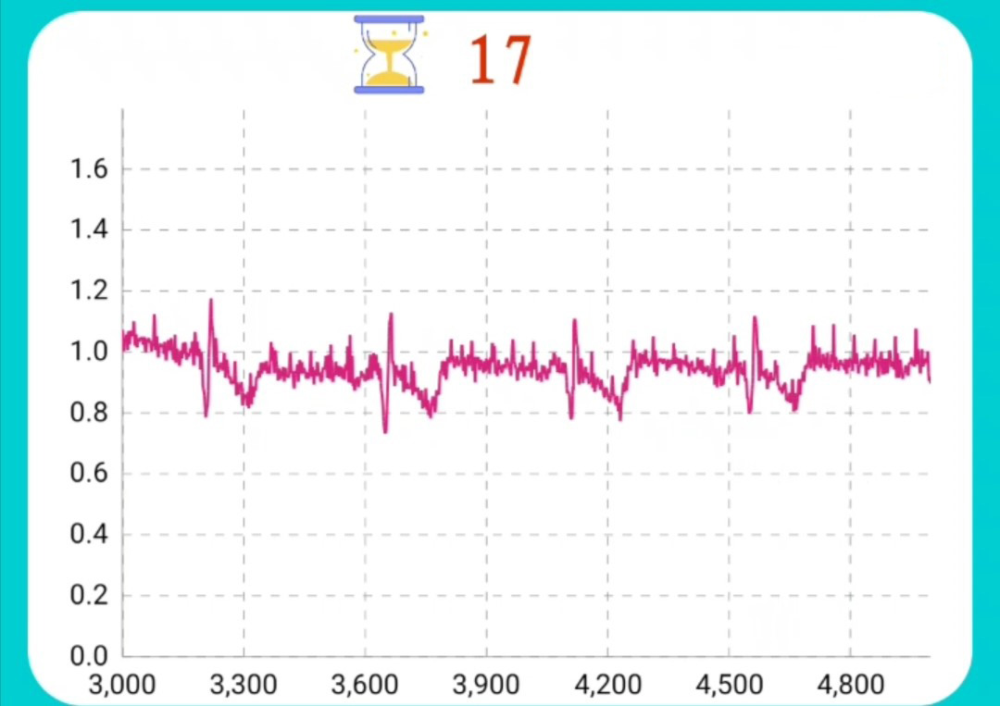

 

&nbsp;&nbsp;&nbsp;&nbsp;&nbsp;&nbsp;&nbsp;&nbsp;On the measurement page, first connect the device, then click the "Measure" button to start heart rate monitoring. During measurement, the electrocardiogram, monitoring indicators and countdown will be displayed in real time. After completion, the system will automatically generate and display the measurement report.

    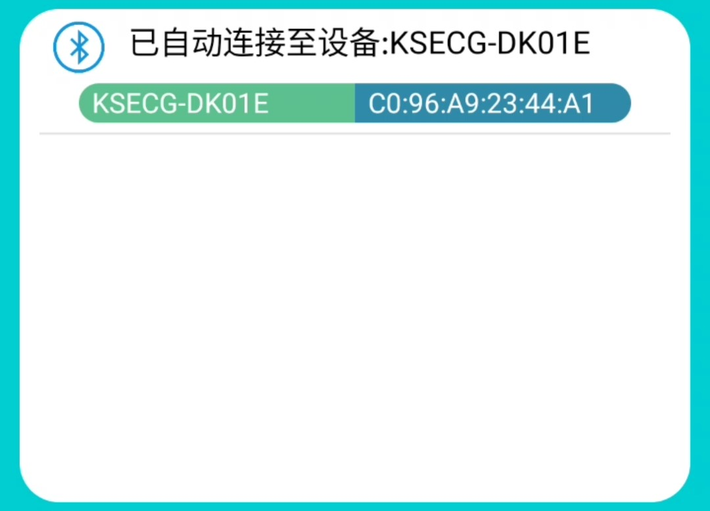
    

    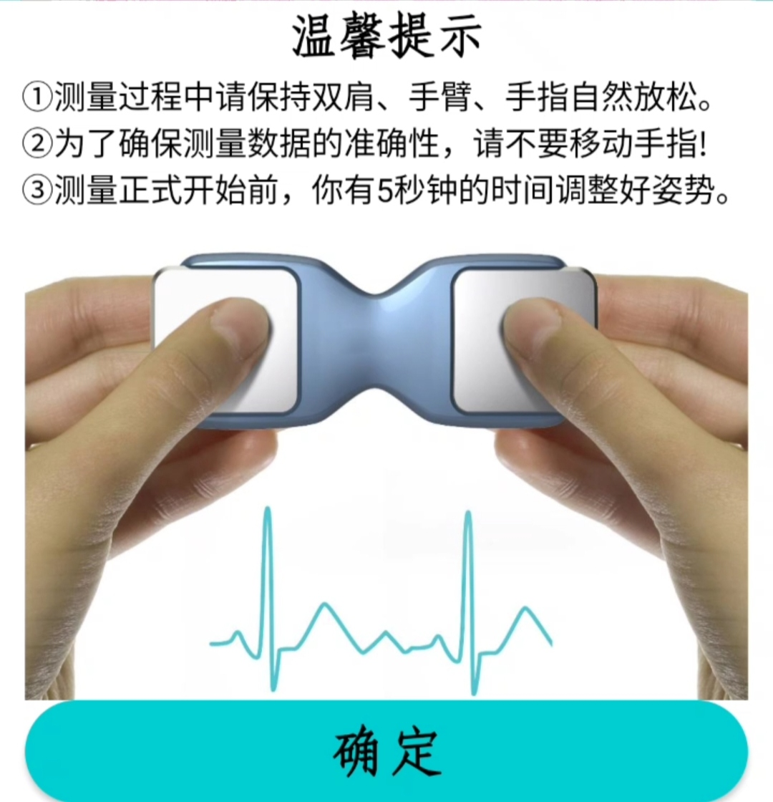
    

    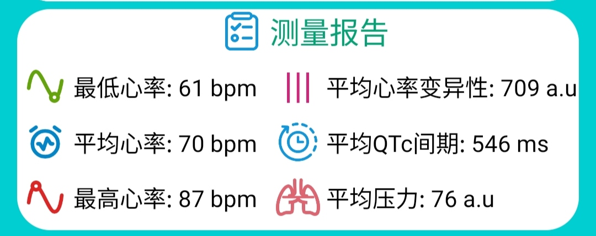

## 3.3 Report Home Page

    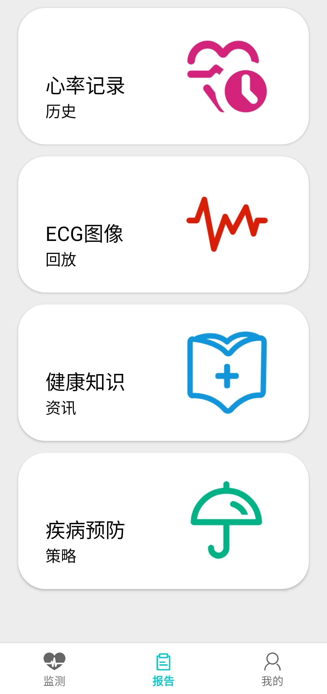
    

    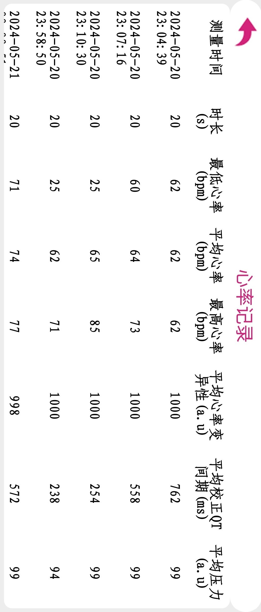
    

    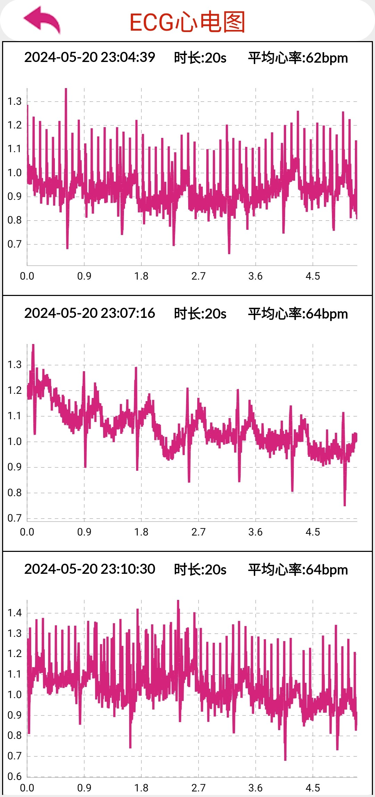

 

&nbsp;&nbsp;&nbsp;&nbsp;&nbsp;&nbsp;&nbsp;&nbsp;The "Report" homepage includes four parts: heart rate record, ECG, health knowledge and disease prevention. The heart rate record displays the report of each measurement in a table. The ECG supports left and right sliding and zooming, which is convenient for viewing the dynamic ECG.

    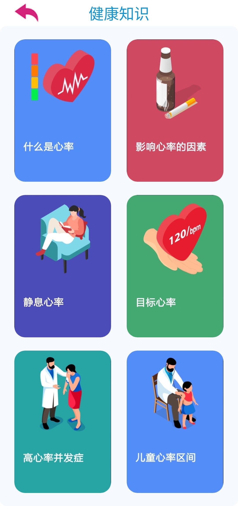
    

    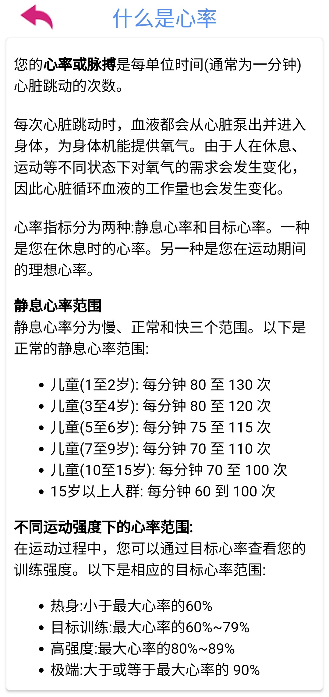
    

    

 

&nbsp;&nbsp;&nbsp;&nbsp;&nbsp;&nbsp;&nbsp;&nbsp;The Health Knowledge page provides a wealth of information related to heart rate, while the Disease Prevention section focuses on heart health and provides a series of targeted prevention strategies and suggestions.

## 3.4 My Homepage

    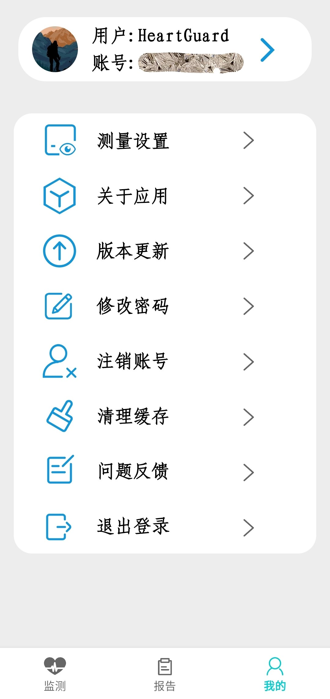
    

    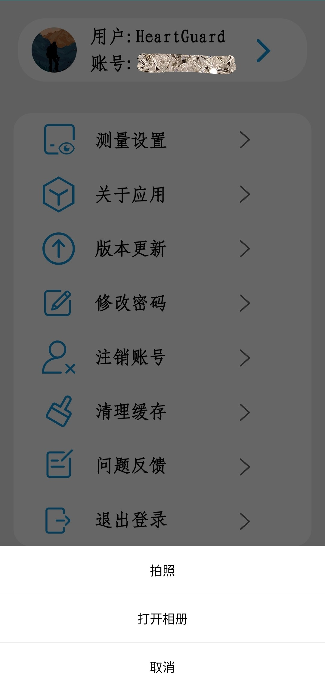
    

    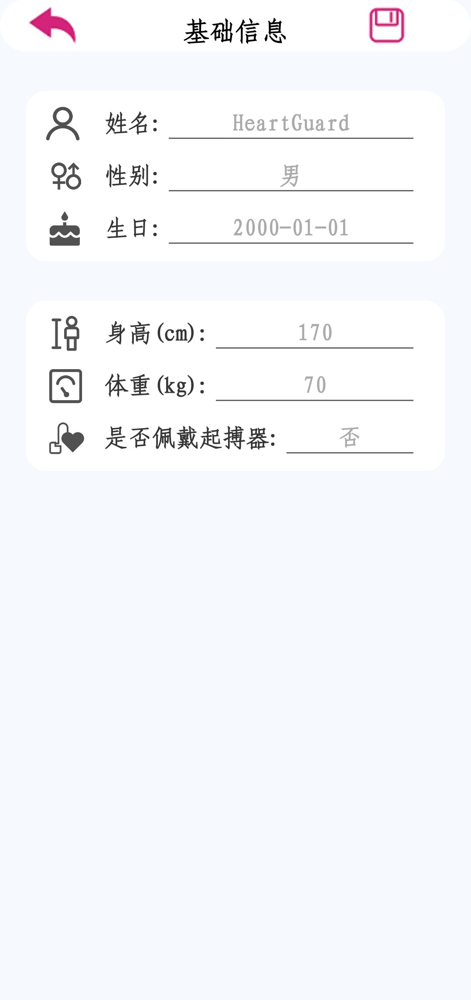

 

&nbsp;&nbsp;&nbsp;&nbsp;&nbsp;&nbsp;&nbsp;&nbsp;&nbsp;The "My" homepage provides users with full control, including personal information, application settings, and account management. Users can easily change avatars, update information, adjust measurement settings, upgrade applications, change passwords, manage accounts, clear caches, submit problem feedback, and log out safely.

    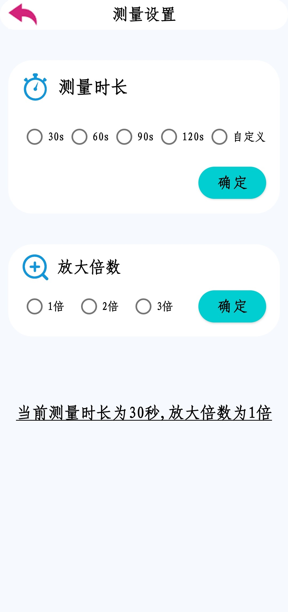
    

    
    

    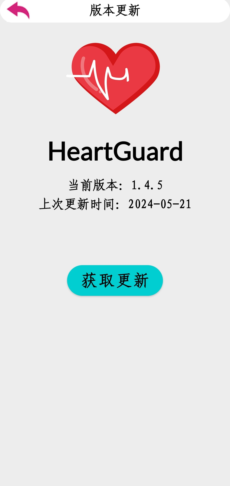

 

# 4. Data storage

&nbsp;&nbsp;&nbsp;&nbsp;&nbsp;&nbsp;&nbsp;&nbsp;When running, this application will automatically generate and store data in the built-in SQLite database, namely HeartGuard.db. These data are distributed in four structured tables to ensure the orderliness and easy management of the data.

  (1) **User Information Table** (UserInfo) is used to store basic information of users.
| Column name         | Data type | Description                             |
| ------------------- | --------- | --------------------------------------- |
| phone_number        | TEXT      | Primary key, phone number               |
| avatar_base64       | TEXT      | Base64 string encoded with avatar image |
| login_password      | TEXT      | Encrypted password field                |
| user_name           | TEXT      | User name                               |
| user_gender         | TEXT      | User gender                             |
| user_birthday       | TEXT      | User birthday                           |
| user_height         | TEXT      | User height                             |
| user_weight         | TEXT      | User weight                             |
| user_wear_pacemaker | TEXT      | Whether the user wears a pacemaker      |
| feedback            | TEXT      | User feedback information               |

 (2) The **ConnectedDevices** table is designed to record information between devices and applications.

| Column name          | Data type | Description                      |
| -------------------- | --------- | -------------------------------- |
| phone_number         | TEXT      | Primary key, phone number        |
| device_name          | TEXT      | Device name                      |
| connect_count        | INTEGER   | Number of connections            |
| last_connection_time | INTEGER   | Timestamp of the last connection |

 (3) **Real-time monitoring data table** (RealTimeData) is used to capture and store monitoring parameters in heart rate monitoring.

| Column name              | Data type | Description                                      |
| ------------------------ | --------- | ------------------------------------------------ |
| timestamp                | INTEGER   | Timestamp, used to record the time point of data |
| hr                       | INTEGER   | Heart rate value                                 |
| hrv                      | INTEGER   | Heart rate variability                           |
| qtc                      | INTEGER   | Corrected QT interval                            |
| stress                   | INTEGER   | Pressure                                         |
| raw_data_0 ~ raw_data_19 | REAL      | Raw data of the collected electrocardiogram      |

 (4) **MeasurementStatistics** is used to store relevant statistical data of heart rate monitoring.

| Column name      | Data type | Description                           |
| ---------------- | --------- | ------------------------------------- |
| phone_number     | TEXT      | Phone number                          |
| measurement_time | INTEGER   | Time point of measurement (timestamp) |
| duration         | TEXT      | Duration of measurement (in seconds)  |
| min_heart_rate   | INTEGER   | Minimum heart rate                    |
| avg_heart_rate   | INTEGER   | Average heart rate                    |
| max_heart_rate   | INTEGER   | Maximum heart rate                    |
| avg_hrv          | DOUBLE    | Average heart rate variability        |
| avg_qtc          | DOUBLE    | Average corrected QT interval         |
| avg_stress       | DOUBLE    | Average stress                        |

# 5. Download the installation package
Link: http://47.121.198.148:1024/share/LnQCMXTbYsfWyMiZymcm  
Extraction code: GNfA7